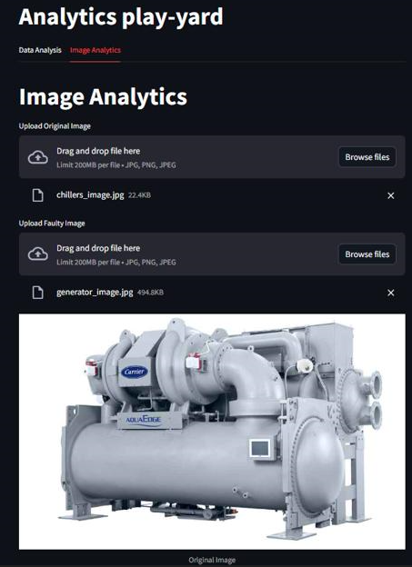
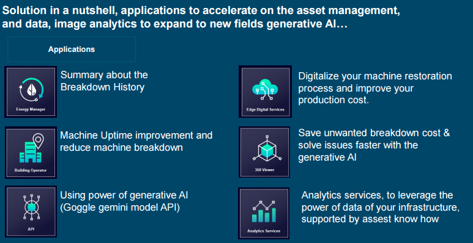
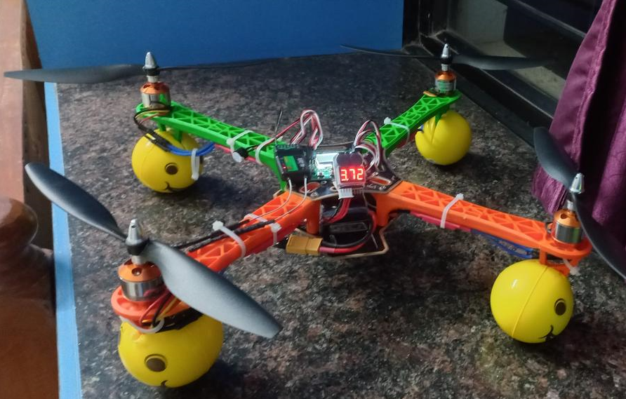

# 💡 **Welcome to My GitHub Portfolio** 👨‍💻

## 🌟 **About Me**

Hi there! I'm **Kishan**, a Senior Data Scientist with over **10+ years of experience** in advanced technologies like **Machine Learning**, **Deep Learning**, **Computer Vision**, and **Generative AI**. My mission is to build innovative solutions that harness the power of data and AI to solve real-world problems. 🚀

---

## 🛠️ **Core Expertise**

### **🔍 Machine Learning & Deep Learning**
- Algorithms: **SVM**, **Random Forest**, **XGBoost**, **ARIMA**, **LSTM**, **CNN**, **Transformers**
- Frameworks:   

### **📊 Data Science & Analytics**
- **Time Series Forecasting** & **Anomaly Detection**
- Feature Engineering, Outlier Removal, Data Preprocessing
- Experiment Tracking: **MlFlow**, **DVC**

### **⚙️ AI-Driven Solutions**
- **Secure-GPT**: Enabling secure document interactions
- **AI-Enabled Drones**: Hardware assembly and autonomous control
- Predictive Models for **Solar** and **Wind Power Forecasting**

### **🌐 Tools & Technologies**
- Languages:   
- Visualization:  
- Platforms:  

---

## 🚀 **Key Projects**

### **1. Machine Troubleshooting Chatbot** 🤖
- **Objective**: Develop a chatbot for real-time issue resolution.
- **Tech Stack**: **GCP**, **Gemini Pro/Vision**
- **Impact**: Optimized machine performance and reduced downtime.

### **2. AI-Enabled Drone** 🚁
- **Objective**: Assemble and program an autonomous drone.
- **Tech Stack**: **Raspberry Pi**, **Quadcopter Components**
- **Applications**: Construction safety, remote monitoring.

### **3. Secure-GPT** 🔐
- **Objective**: Build a secure, offline-friendly AI document assistant.
- **Tech Stack**: Custom **Language Models**, Local Data Handling
- **Impact**: Enhanced privacy and user convenience.

---

## 🌟 **Achievements**

- 🌟 **Developed AI models** for time series forecasting with 90%+ accuracy.
- 🌍 **Deployed scalable AI systems** in cloud environments like AWS and Huawei ModelArts.
- 🏆 **Recognized for innovation** in AI-driven industrial automation.

---

## 📈 **Statistics**

---

## 🖼️ **Gallery**

### **Machine Troubleshooting Chatbot**

### **AI-Enabled Drone in Action**

---

## 📫 **Let's Connect!**

- **LinkedIn**: [Kishan's LinkedIn](https://www.linkedin.com/in/kishan-rajoria-9a718775/?profileId=ACoAAA_dmM8BE9p8AAAQG2t2BT48iCPqYKzcdT4)
- **Email**: [kishan@example.com](mailto:kishanrajoria@gmail.com)
- **GitHub**: [Kishan's GitHub](https://github.com/kishan-rajoria)

---

## 💻 **My Work Philosophy**

> "Data is the new oil, and AI is the engine driving innovation."

Thank you for stopping by! Don't forget to ⭐ **Star** and 🍴 **Fork** my repositories if you find them useful. Together, let’s build the future! 🚀

